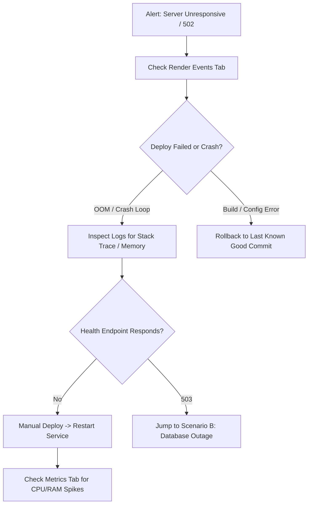

# LayoScan Production Operations & Incident Response Runbook

> **Audience**: On-call engineers, DevOps/SREs, and system administrators.  
> **Purpose**: Practical, step-by-step triage, disaster recovery, secret rotation, and incident resolution for LayoScan production environments. Designed for fast action during an active incident.

---

## Table of Contents

1. [System Overview & Architecture](#1-system-overview--architecture)
2. [MongoDB Atlas Backup Policy](#2-mongodb-atlas-backup-policy)
3. [Disaster Recovery & Restore Procedures](#3-disaster-recovery--restore-procedures)
4. [Secret & Key Rotation Runbook](#4-secret--key-rotation-runbook)
5. [Incident Response Playbooks](#5-incident-response-playbooks)
   - [Scenario A: Server Unresponsive / 502 Bad Gateway](#scenario-a-server-unresponsive--502-bad-gateway)
   - [Scenario B: Database Connection Lost (503 Service Unavailable)](#scenario-b-database-connection-lost-503-service-unavailable)
   - [Scenario C: High Error Rate (5xx Surges)](#scenario-c-high-error-rate-5xx-surges)
   - [Scenario D: Rate Limit Abuse / 429 Storms](#scenario-d-rate-limit-abuse--429-storms)
   - [Scenario E: Socket.io Disconnections & Real-Time Sync Outage](#scenario-e-socketio-disconnections--real-time-sync-outage)
   - [Scenario F: Cloudinary Image Upload Failures](#scenario-f-cloudinary-image-upload-failures)
6. [Service Rollback Procedures](#6-service-rollback-procedures)
7. [Operational Monitoring Checklist](#7-operational-monitoring-checklist)
8. [External Status Pages & Contacts](#8-external-status-pages--contacts)

---

## 1. System Overview & Architecture

LayoScan is composed of three decoupled production services:

| Component | Hosting Platform | Runtime / Tech Stack | Primary Responsibilities |
| :--- | :--- | :--- | :--- |
| **Backend API** | [Render](https://dashboard.render.com) | Node.js (Express, Socket.io, Mongoose) | REST API, WebSockets, rate limiting, authentication |
| **Customer App** | [Vercel](https://vercel.com) | React / Vite SPA | QR code table ordering, digital menu, bill request |
| **Dashboard App**| [Vercel](https://vercel.com) | React / Vite SPA | Kitchen display system (KDS), menu manager, table oversight |
| **Database** | [MongoDB Atlas](https://cloud.mongodb.com) | MongoDB Replica Set (M10+) | Multi-tenant operational data store |
| **Asset Storage**| [Cloudinary](https://cloudinary.com) | CDN & Image Store | Restaurant branding and menu item photography |

### Core Service Ports & Health Endpoints
- **Render Backend Base URL**: `https://<service-name>.onrender.com`
- **Health Check Endpoint**: `GET /api/health`
  - `200 OK`: Server running, MongoDB responsive to admin ping.
  - `503 Service Unavailable`: MongoDB disconnected or ping timeout.

---

## 2. MongoDB Atlas Backup Policy

MongoDB Atlas handles automated continuous cloud backups and daily snapshot schedules.

### Policy Configuration

1. **Continuous Cloud Backups**:
   - Ensure continuous backups are **Enabled** on the production cluster.
   - Continuous backup captures oplog history to allow granular recovery to any second within the retention window.
2. **Point-in-Time Restore (PITR) Window**:
   - **Starter / Tier M10–M20**: Set to **7 days**.
   - **Business Critical / Tier M30+**: Set to **30 days**.
3. **Daily Snapshots**:
   - Automated daily snapshots taken at **03:00 UTC** (off-peak).
   - **Snapshot Retention**: Minimum **7 days** for daily snapshots, **4 weeks** for weekly snapshots, and **12 months** for monthly compliance archives.

### Verifying Backup Health (Atlas UI)

1. Log into [MongoDB Atlas](https://cloud.mongodb.com/).
2. Select your Project and the production Cluster.
3. Click the **Backup** tab in the cluster navigation bar.
4. Verify the following:
   - Status badge displays **Continuous Cloud Backups Active**.
   - The **Latest Point in Time** timestamp is within the last **10 minutes**.
   - The snapshot table lists a recent snapshot from the last **24 hours** with status **Completed**.

---

## 3. Disaster Recovery & Restore Procedures

### Procedure A: Restore via Atlas Web UI (Recommended)

When recovering from major data corruption or accidental deletions:

1. Open **Atlas UI** → Target Cluster → **Backup** tab.
2. Click **Restore Backup**.
3. Choose the restore type:
   - **Point in Time**: Select the exact date and time (UTC) right before the incident occurred.
   - **Snapshot**: Select a known healthy snapshot from the list.
4. Select the **Restore Destination**:
   - **Option 1 (Safest — Recommended)**: *Restore to a New Cluster*  
     Name the cluster (e.g., `layoscan-restore-temp`). This allows inspection and selective data recovery without overwriting existing data.
   - **Option 2 (Direct In-Place Overwrite)**: *Restore to this Cluster*  
     > ⚠️ **CAUTION**: This replaces the active production database and causes 5–15 minutes of cluster downtime.
5. Click **Confirm Restore**. Wait for Atlas provisioning to complete (track progress in the Atlas Activity Feed).
6. If restored to a new cluster:
   - Copy the new connection string from **Connect** → **Drivers**.
   - Update `MONGO_URI` in Render Environment Variables.
   - Restart the Render web service.

---

### Procedure B: CLI Restore with `mongorestore` (Local / Staging)

For staging validation, forensic debugging, or restoring specific collections:

#### 1. Download Backup Archive
Download the snapshot archive (`.tar.gz` or `.archive`) from the Atlas UI: **Backup** → Snapshot row → **...** → **Download**.

#### 2. Restore to Local Environment
Extract the archive and execute `mongorestore`:

```bash
# Restore entire database to local MongoDB
mongorestore --uri="mongodb://localhost:27017/layoscan_test" \
  --archive="dump.archive" \
  --gzip \
  --drop

# Restore a specific collection only (e.g. orders)
mongorestore --uri="mongodb://localhost:27017/layoscan_test" \
  --nsInclude="layoscan.orders" \
  --archive="dump.archive" \
  --gzip
```

#### 3. Restore to Atlas Staging Cluster
```bash
mongorestore --uri="mongodb+srv://<USER>:<PASSWORD>@<STAGING_CLUSTER>.mongodb.net/layoscan" \
  --archive="dump.archive" \
  --gzip \
  --drop
```

---

### Procedure C: Post-Restore Checklist

Immediately after any database restore:

- [ ] **1. Data Integrity Check**:
  Connect using `mongosh` or MongoDB Compass and verify collection counts:
  ```bash
  mongosh "<MONGO_URI>"
  ```
  ```javascript
  db.restaurants.countDocuments();
  db.branches.countDocuments();
  db.tables.countDocuments();
  db.orders.countDocuments();
  db.users.countDocuments();
  ```
- [ ] **2. Check Table Session Consistency**:
  Look for orphaned occupied tables whose sessions expired during downtime:
  ```javascript
  db.tables.find({ status: "occupied", sessionExpiresAt: { $lt: new Date() } });
  ```
  Run session cleanup or let the background 60s sweep reset them.
- [ ] **3. Restart Render Web Service**:
  Trigger a manual restart from Render Dashboard → **Manual Deploy** → **Restart service** to refresh Mongoose connection pools and trigger a table session sweep.
- [ ] **4. Verify Healthcheck Endpoint**:
  ```bash
  curl -s -i https://<render-service-url>.onrender.com/api/health
  # Must return HTTP 200 with {"status":"ok","checks":{"database":"connected"}}
  ```
- [ ] **5. Test Real-time Dispatch**:
  Log into the Dashboard app, toggle a table status, and verify that the UI updates immediately via WebSockets.

---

## 4. Secret & Key Rotation Runbook

Rotate all secrets **quarterly** or **immediately** upon team member departures or suspected credential leaks.

### 4.1 `JWT_SECRET` Rotation

> **Impact**: Invalidate **all active access tokens** (15-min TTL) and refresh tokens. All active staff sessions in the dashboard app will be logged out and forced to re-authenticate.

1. Generate a secure 64-byte random string:
   ```bash
   node -e "console.log(require('crypto').randomBytes(64).toString('base64url'))"
   # or with OpenSSL:
   openssl rand -base64 48
   ```
2. Navigate to [Render Dashboard](https://dashboard.render.com/) → `server` Web Service → **Environment**.
3. Locate `JWT_SECRET`, click **Edit**, and paste the newly generated string.
4. Click **Save Changes**. Render will automatically trigger a rolling zero-downtime redeploy.
5. Notify staff that they will be prompted to log back in.

---

### 4.2 `JWT_REFRESH_SECRET` Rotation

> **Impact**: Current 15-minute access tokens remain valid until expiration. All 7-day refresh tokens are invalidated immediately. Users will not be logged out until their current access token expires.

1. Generate a new random secret:
   ```bash
   node -e "console.log(require('crypto').randomBytes(64).toString('base64url'))"
   ```
2. In Render Dashboard → `server` → **Environment**, update `JWT_REFRESH_SECRET`.
3. Save changes and allow the deploy to finish.

---

### 4.3 Cloudinary Credentials Rotation

> **Impact**: Image upload endpoints (`POST /api/upload`) will fail if credentials mismatch. Existing CDN-cached images remain visible to customers.

1. Log into the [Cloudinary Console](https://console.cloudinary.com/).
2. Navigate to **Settings** (gear icon) → **Access Keys**.
3. Click **Generate New Key**.
4. In Render Dashboard → `server` → **Environment**, update:
   - `CLOUDINARY_CLOUD_NAME`
   - `CLOUDINARY_API_KEY`
   - `CLOUDINARY_API_SECRET`
5. Save changes and redeploy.
6. Verify uploads work by uploading a sample menu item image in the Dashboard app.
7. Return to Cloudinary and **Revoke** the previous key.

---

### 4.4 MongoDB Connection String (`MONGO_URI`) Rotation

> **Zero-Downtime Procedure**: Create a new database user before deleting the old one.

1. Log into [MongoDB Atlas](https://cloud.mongodb.com/).
2. Navigate to **Database Access** under Security → Click **Add New Database User**.
3. Choose **Password Authentication**, generate a strong 32+ character password, and set user privileges to `readWriteAnyDatabase` or `readWrite@layoscan`.
4. Construct the new connection string:
   ```text
   mongodb+srv://<NEW_USER>:<ENCODED_NEW_PASSWORD>@<CLUSTER>.mongodb.net/layoscan?retryWrites=true&w=majority
   ```
   *(Ensure special characters in the password are URL-encoded)*.
5. Update `MONGO_URI` in Render Environment Variables and click **Save Changes**.
6. Verify deployment succeeds and test the health endpoint:
   ```bash
   curl https://<render-service-url>.onrender.com/api/health
   ```
7. Return to Atlas **Database Access** and **Delete** the old user.

---

## 5. Incident Response Playbooks

### Scenario A: Server Unresponsive / 502 Bad Gateway



1. **Check Render Events**:
   - Open [Render Dashboard](https://dashboard.render.com/) → `server` → **Events**.
   - Look for `Service crashed`, `Out of Memory (OOM)`, or failed builds.
2. **Review Real-Time Logs**:
   - Switch to the **Logs** tab. Check for uncaught exception traces, missing environment variable errors (`[LayoScan] Fatal startup error:`), or unhandled promise rejections.
3. **Probe Health Check**:
   ```bash
   curl -i -m 10 https://<render-service-url>.onrender.com/api/health
   ```
4. **Examine Instance Metrics**:
   - Open the **Metrics** tab.
   - If Memory reaches 100% of instance limit (e.g. 512 MB on Starter), the Node.js process was killed by the OS kernel OOM killer.
5. **Mitigation**:
   - **Quick fix**: Click **Manual Deploy** → **Restart service**.
   - **Persistent OOM**: Upgrade instance plan or optimize memory usage (see Scenario E).

---

### Scenario B: Database Connection Lost (503 Service Unavailable)

**Symptoms**: `/api/health` returns `503`, logs show `MongooseServerSelectionError` or `[LayoScan] MongoDB connection failed:`.

1. **Check Atlas Platform Status**:
   - Visit [Atlas Status Page](https://status.cloud.mongodb.com/). If Atlas is degraded, monitor their incident communications.
2. **Verify Atlas Network Access (IP Whitelist)**:
   - Atlas Console → **Network Access**.
   - Render's standard web services have dynamic outbound IP addresses. Verify that `0.0.0.0/0` (Allow Access from Anywhere) is active and not expired.
   - If using Render Static Outbound IPs, ensure all outbound IPs are present in the whitelist.
3. **Verify Environment Variable**:
   - Verify `MONGO_URI` in Render. Look for accidentally truncated strings, missing database name, or unencoded characters in passwords (e.g., `#`, `@`, `?`).
4. **Test Direct Connection**:
   Test connectivity from a local workstation or bastion:
   ```bash
   mongosh "<MONGO_URI>" --eval "db.adminCommand('ping')"
   ```
5. **Restart Server**:
   Once Atlas connectivity is restored, restart the Render service so Mongoose reconnects cleanly.

---

### Scenario C: High Error Rate (5xx Surges)

**Symptoms**: Spike in 500 errors, customer complaints that orders are failing to submit.

1. **Filter Structured Logs**:
   LayoScan uses `pino-http`. In Render Logs, search for error-level logs:
   ```text
   level=error
   ```
   Or look for status code entries:
   ```text
   "statusCode":500
   ```
2. **Isolate Request ID**:
   Extract the `req.id` or `x-request-id` from the error log to trace the complete lifecycle of the failing call.
3. **Identify Fault Domain**:
   - `POST /api/orders`: Check if Mongoose schema validation failed, or table was marked as `available` while order was submitted.
   - `POST /api/public/table/:qrToken`: Check if table QR token has expired or table ID is malformed.
   - `POST /api/upload`: Check Cloudinary rate limits or token expirations.
4. **Check Resource Metrics**:
   Check if CPU utilization is maxing out (event loop lag) causing request timeouts.
5. **Mitigation**:
   - If introduced by a recent release, execute an immediate [Backend Rollback](#61-render-backend-rollback).

---

### Scenario D: Rate Limit Abuse / 429 Storms

**Symptoms**: Legitimate users receive HTTP `429 Too Many Requests` ("Too many requests. Please wait a moment and try again."), or logs show high-frequency hits from single IP addresses.

1. **Identify the Abusive IP**:
   In Render logs, inspect the incoming IP addresses:
   ```text
   status=429
   ```
2. **Determine the Triggered Limiter**:
   - `authLimiter` (`RATE_LIMIT_AUTH_MAX`, default: 30 / 15m) — Login/register brute-force.
   - `tableResolveLimiter` (`RATE_LIMIT_PUBLIC_TABLE_MAX`, default: 120 / 15m) — QR token brute-force.
   - `publicWriteLimiter` (`RATE_LIMIT_PUBLIC_WRITE_MAX`, default: 60 / 15m) — Order / Call-waiter spam.
3. **Adjust Environment Variables (If legitimate restaurant rush)**:
   If a high-capacity restaurant triggers false positives during peak hours:
   - Increase limits in Render Environment:
     ```env
     RATE_LIMIT_PUBLIC_TABLE_MAX=300
     RATE_LIMIT_PUBLIC_WRITE_MAX=150
     RATE_LIMIT_AUTH_MAX=60
     ```
   - Save and redeploy.
4. **Block Malicious IPs**:
   - If an attack is overwhelming the server, configure an IP access rule at the CDN / Cloudflare level before traffic reaches Render.
   - *Never set `RATE_LIMIT_DISABLED=true` in production.*

---

### Scenario E: Socket.io Disconnections & Real-Time Sync Outage

**Symptoms**: Dashboard orders do not refresh automatically; staff have to manually reload; customer app does not receive order status changes.

1. **Verify CORS Allowlist**:
   Socket.io will reject connections with `Origin not allowed by CORS` if origins do not match.
   - Check Render env vars:
     - `CLIENT_URL_CUSTOMER` must match exact Vercel customer URL (e.g. `https://layoscan-customer.vercel.app` — **no trailing slash**).
     - `CLIENT_URL_DASHBOARD` must match exact Vercel dashboard URL.
     - Custom domains must be added to `ALLOWED_ORIGINS` (comma-separated).
2. **Check Memory Footprint**:
   Each persistent WebSocket connection consumes memory.
   - Check Render **Metrics** → Memory.
   - If memory is climbing steadily, verify whether disconnected sockets are cleaning up or if table session sweep is running.
3. **Verify Client Reconnection**:
   - Open browser developer tools on Dashboard → **Network** tab → filter by `WS`.
   - Inspect the Socket.io handshake (`/socket.io/?EIO=4&transport=websocket`).
   - If WebSocket fails, confirm if fallback HTTP long-polling succeeds.
4. **Mitigation**:
   - Restart the Render backend service to drop zombie socket handles and release RAM.

---

### Scenario F: Cloudinary Image Upload Failures

**Symptoms**: Menu photo uploads fail with 500 error in Dashboard.

1. **Inspect Upload Endpoint Logs**:
   Filter logs for `POST /api/upload/image`. Look for Cloudinary SDK error responses.
2. **Verify Credentials**:
   Confirm that `CLOUDINARY_CLOUD_NAME`, `CLOUDINARY_API_KEY`, and `CLOUDINARY_API_SECRET` are present in Render env vars.
3. **Check Cloudinary Status & Quota**:
   - Visit [Cloudinary Status](https://status.cloudinary.com/).
   - Log into Cloudinary Dashboard and verify account **Credits Usage**. Free tier plans will block uploads if the monthly credit ceiling is breached.
4. **File Size and MIME Validation**:
   - Ensure the image file does not exceed maximum payload limits (5MB recommended).
   - Only `image/jpeg`, `image/png`, and `image/webp` are permitted.

---

## 6. Service Rollback Procedures

### 6.1 Render (Backend) Rollback

If a newly deployed backend release causes crashes, errors, or data inconsistencies:

1. Open the [Render Dashboard](https://dashboard.render.com/) and select the `server` Web Service.
2. In the left navigation, click **Deploys**.
3. Locate the **last known healthy deploy** in the deployment history.
4. Click the three dots (**...**) on that deployment row and select **Rollback to this deploy**.
5. Wait for the build and container startup to complete.
6. Verify rollback success:
   ```bash
   curl -i https://<render-service-url>.onrender.com/api/health
   ```

---

### 6.2 Vercel (Customer & Dashboard Frontend) Rollback

Vercel supports instant zero-downtime rollbacks without rebuilding:

1. Open the [Vercel Dashboard](https://vercel.com/) and select the affected project:
   - `customer-app` or `dashboard-app`.
2. Click the **Deployments** tab.
3. Locate the previous stable production deployment.
4. Click the **...** (Options) icon next to the commit and select **Promote to Production**.
5. Confirm the promotion. Traffic switches instantly to the selected deployment.
6. Open the live URL in an incognito window and verify the UI functions properly.

---

### 6.3 Database Rollback (Destructive Schema / Data Corruption)

If a release executed a destructive database migration or corrupted records:

1. **Immediately pause traffic**: Put the backend into maintenance mode or stop the service in Render to prevent further writes.
2. Open **MongoDB Atlas** → Cluster → **Backup** tab.
3. Perform a **Point-in-Time Restore** to the minute immediately preceding the bad deployment (see [Section 3: Procedure A](#procedure-a-restore-via-atlas-web-ui-recommended)).
4. Revert and redeploy the backend code before re-enabling traffic.
5. Bring the backend service back online and test `/api/health`.

---

## 7. Operational Monitoring Checklist

### Daily Operational Checklist (5-minute routine)

- [ ] **Render API Health**:  
  Ensure `GET /api/health` returns `200 OK` with database connected.
- [ ] **Error Log Inspection**:  
  Scan Render logs filtered for `level=error`. Ensure zero unhandled exceptions.
- [ ] **Atlas Cluster Metrics**:  
  Check Atlas CPU utilization (< 70%), memory usage, and connection counts (< 80% of tier limit).
- [ ] **Rate Limiting Frequency**:  
  Search logs for `status=429`. Verify no legitimate customers or tables are being throttled.
- [ ] **Order Continuity**:  
  Confirm in the Dashboard that active restaurants are successfully generating and completing orders.

### Weekly Maintenance Checklist

- [ ] **Backup Verification**:  
  Confirm Atlas daily snapshots are completing successfully on schedule.
- [ ] **Disk Space Headroom**:  
  Ensure MongoDB Atlas storage has at least 30% free headroom.
- [ ] **Cloudinary Usage**:  
  Review monthly storage and bandwidth consumption against quotas.
- [ ] **TLS / SSL Validity**:  
  Verify SSL certificates on custom domains are renewing properly with > 30 days remaining.
- [ ] **Security Dependabot Alerts**:  
  Review and patch high/critical vulnerabilities identified in GitHub Security tab.

---

## 8. External Status Pages & Contacts

When investigating external outages, check official status dashboards:

| Provider | Service | Official Status Page |
| :--- | :--- | :--- |
| **Render** | Backend Hosting | [https://status.render.com](https://status.render.com) |
| **MongoDB Atlas** | Managed Database | [https://status.cloud.mongodb.com](https://status.cloud.mongodb.com) |
| **Vercel** | Frontend Edge Hosting | [https://www.vercel-status.com](https://www.vercel-status.com) |
| **Cloudinary** | Image Storage & CDN | [https://status.cloudinary.com](https://status.cloudinary.com) |

### Internal Escalation Directory

| Role | Responsibility | Contact Method |
| :--- | :--- | :--- |
| **Primary On-Call** | Initial triage, service restarts, rollbacks | PagerDuty / Ops Channel |
| **Secondary On-Call / Lead** | Database restoration, key rotation, incident lead | Emergency Phone / Slack |
| **Database Administrator** | MongoDB Atlas schema recovery, tier scaling | Atlas Admin Group |
